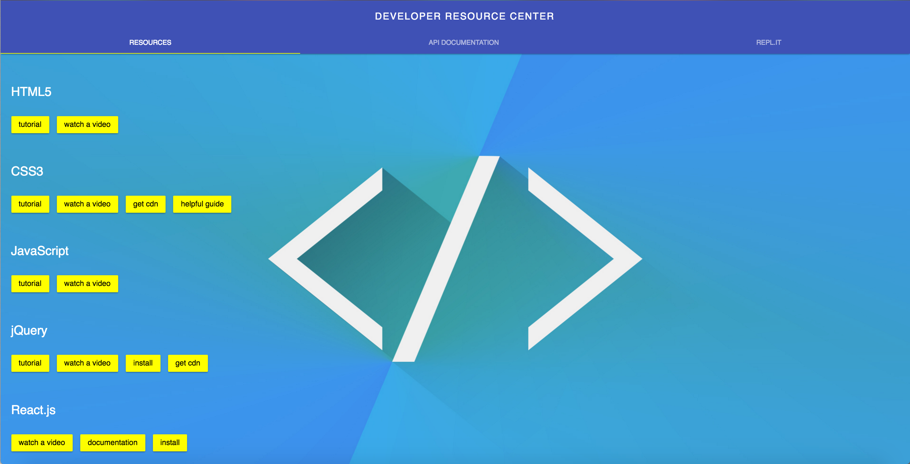
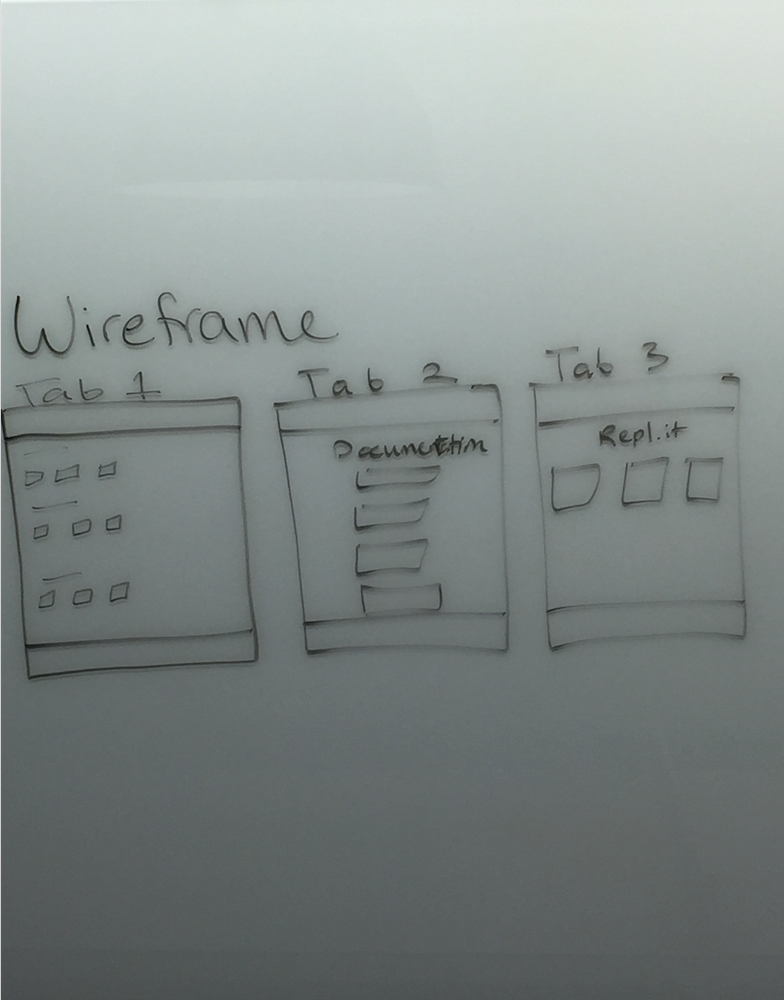

# Developer Resource Center

## The App
Developer Resource Center is an API for developers to receive quick access to documentation, helpful videos, tutorials and other useful information. The API has two endpoints: one to recieve every topic and its resources and another to recieve a single topic and its resources. All data is received as a JSON object.
 

 
## Technologies Used
Node.js, Express.js, NoSQL with MongoDB, Mongoose, Material Design Lite, HTML5, CSS3, JavaScript, jQuery, AJAX

I used the MEN stack (MongoDB, Express, Node) to build a database for my API and to build routes for GET requests to the endpoints of my API.

I used Mongoose to create and save data into my database on mLab. mLab is the hub that houses all the topics and resources of my API.

I used CSS to style everything along with Google's Material Design Lite to make my page extremely user friendly.

## Approach Taken
Before I began coding my API, I did the following:
* User Stories
* ERD
* Wireframe
* Set my day-to-day goals

To begin my project, I created a local repository and created a second branch. 
I completed my MVP, added a bonus feature, then added material design lite.

## User Stories
* User comes to site
* User clicks on any link of their choice
* User views API documentation in order to start using the API for their own project
* User clicks the repl.it tab to practice coding

## Moving Forward
I would like to add more data to my API and style the resources tab differently to be more user friendly.

